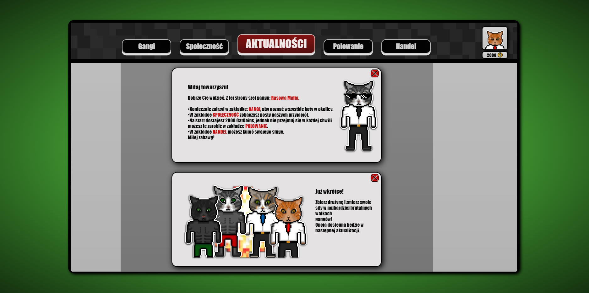

_________________
**Strona dla miłośników kotów, w stylu pixelowej gry.**
Projekt wykonywałam lokalnie korzystając z XAMPPa oraz bazy danych `cats_gang` ().
Grafika wykonywana jest przezemnie za pomocą `pixilart`.
Wykorzystane technologie: `HTML`,`CSS`,`PHP`,`JavaScript`.

Użytkownicy mają możliwość:
-utworzyć swojego użytkownika dokonując rejestracji
    
    
    
-przeglądać aktualności
    
-sprawdzić liczebność poszczególnych gangów
    
-dodawać i polubiać posty
    
-zagrać w mini-grę polegającą na polowaniu
    
-kupować sługów
    
-oraz podejrzeć swój profil wraz ze swoimi sługami i polubionymi postami.
    
_________________
